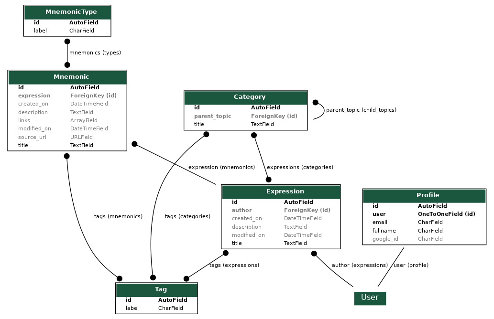

# Mnemonics REST API

## Development and deploy instructions
- To install the production/stage requirements use:
  `pip install -r requirements.txt`
- To install the development requirements use:
  `pip install -r ./requirements/dev-requirements.txt`
  - If you find a problem related with pygraphviz make sure you have installed graphviz previously on your machine(MacOS: `brew install graphviz`)
- To make the migrations:
  - `python manage.py makemigrations`
  - `python manage.py migrate`
  - Also run `python manage.py graph_models mnemonics <OTHER_APPS> -o models.png` to update the graphical representation of the app models
- Finally, To run a dev server:
`python manage.py runserver`
  
- To generate docs in an `api.yaml` use:
    - `python manage.py generate_swagger -f yaml api.yaml`

- To deploy to heroku:
    - Create an heroku app using `heroku create`
    - Add PostgreSQL add-on to the app by using `heroku addons:create heroku-postgresql:hobby-dev`(hobby dev is the free version)
      - When the Add-on is added, a DATABASE_URL variable is created, we read this in the `settings.py` file
    - As we don't have an static files(STATIC_ROOT), we should disable the static collection `heroku config:set DISABLE_COLLECTSTATIC=1`
    - Create a `Procfile`:
      - Apply migrations on release
      - Uses gunicorn to run the Django Rest Framework server
    - Create a `runtime.txt` file that contains the python version to be used(so heroku will use the Python build stack).

- For continuous deployment(CD), make sure to have the variables `HEROKU_APP_STAGING` and `HEROKU_API_KEY` in the Gitlab project CI/CD settings

## Models:

